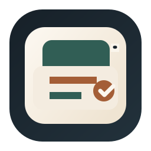
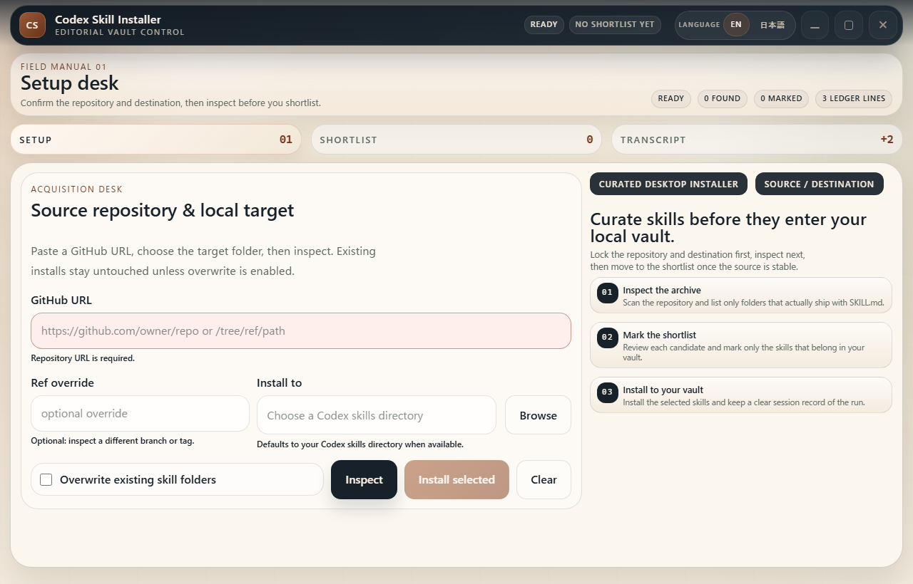
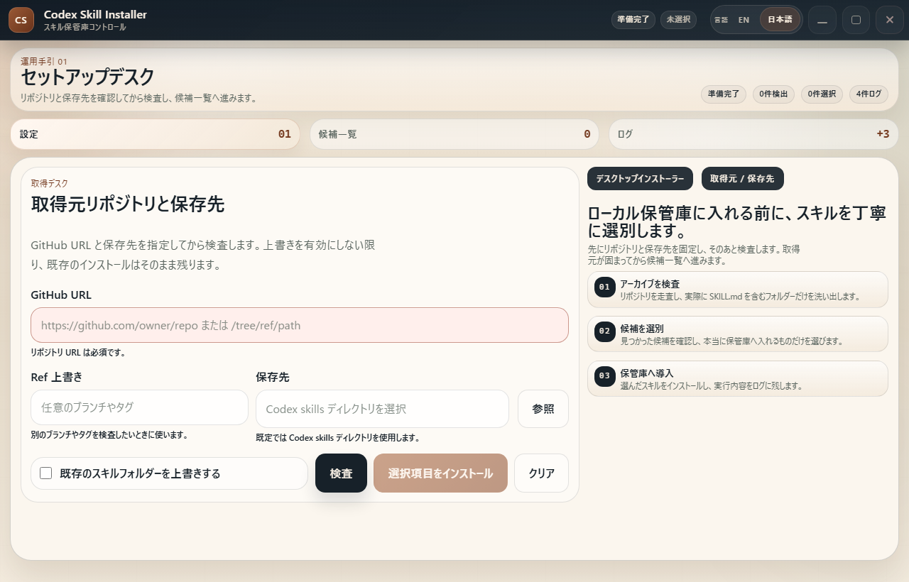
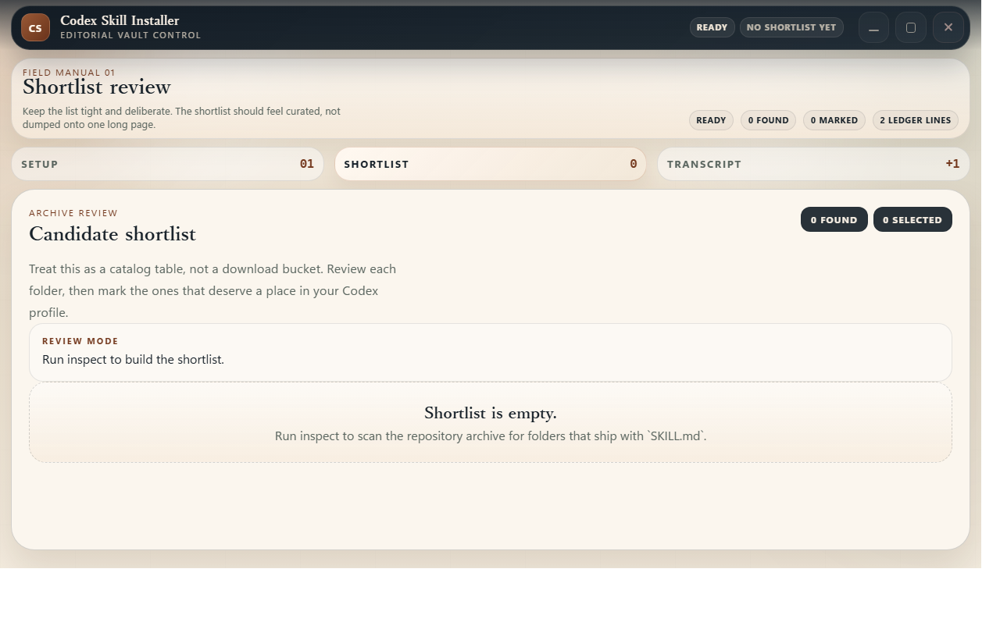
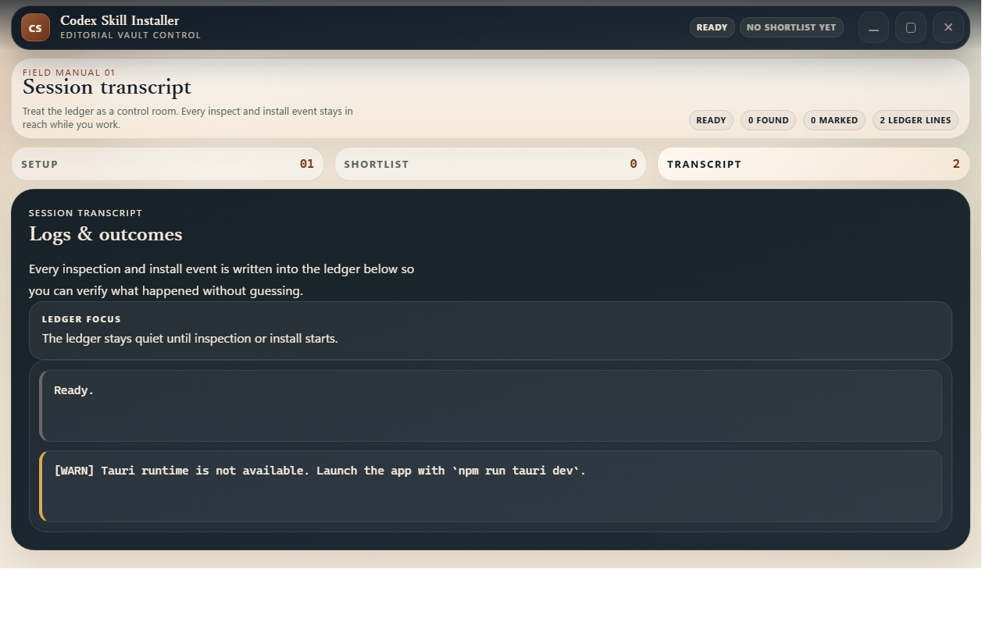

<p align="center">
  
</p>

<h1 align="center">Codex Skill Installer</h1>

<p align="center">
  Install skills from GitHub repositories into your local Codex skills directory with a review-first desktop flow.
</p>

<p align="center">
  English · <a href="README.ja.md">日本語</a>
</p>

<p align="center">
  <a href="https://github.com/Sunwood-ai-labs/codex-skill-installer/actions/workflows/build-desktop.yml">
    
  </a>
  <a href="https://github.com/Sunwood-ai-labs/codex-skill-installer/actions/workflows/deploy-docs.yml">
    
  </a>
  <a href="LICENSE">
    
  </a>
</p>

Codex Skill Installer is a Tauri 2 desktop app with a React + TypeScript frontend and a Rust core. It keeps the original GitHub-to-Codex workflow, but presents it in a calmer desktop shell that is easier to inspect before anything is installed.

## ✨ Highlights

- Paste a GitHub repository, `tree`, or `blob` URL and inspect it for folders that contain a skill manifest (`SKILL.md` or `skill.md`).
- Review the detected skills in a dedicated shortlist before installing anything.
- Install selected skills into the local Codex skills directory with optional overwrite support.
- Work through top-level `Setup`, `Shortlist`, and `Transcript` tabs instead of one long scrolling form.
- Switch the desktop UI between English and Japanese with a persisted language toggle in the custom title bar.

## 🚀 Quick Start

```powershell
npm install
npm run tauri dev
```

## 🧭 How It Works

1. Enter a GitHub repository, `tree`, or `blob` URL.
2. Optionally override the ref if you want to inspect a different branch or tag.
3. Choose the destination folder for the Codex skills install.
4. Inspect the repository, review the shortlist, and install only the skills you want.

## 📁 Default Install Target

The app follows the common Codex skills layout:

- `CODEX_HOME/skills` when `CODEX_HOME` is set
- Windows fallback: `%USERPROFILE%\.codex\skills`
- macOS and Linux fallback: `~/.codex/skills`

## 🖼️ Screenshots

The current desktop shell uses a flush custom title bar, unified locale-aware typography, and a compact-height layout that keeps the `Setup` tab readable around `1280x820`.

English `Setup`:



Japanese `Setup`:



Shortlist:



Transcript:



## 📚 Documentation

- [Docs landing page](docs/index.md)
- [UI tour](docs/ui-tour.md)
- [Japanese docs landing page](docs/ja/index.md)
- [Japanese UI tour](docs/ja/ui-tour.md)

## 🛠️ Validation

- Frontend build and typecheck: `npm run build`
- Rust unit tests: `cargo test --manifest-path src-tauri/Cargo.toml`
- Browser Playwright smoke for the public root-level `skill.md` fixture repo: `npm run test:e2e:root-skill-md`
- UI evidence: tracked screenshots under `docs/screenshots/`, including English and Japanese `Setup` captures at `1280x820`

## 📦 Production Build

```powershell
npm run tauri build
```

Build output is written under `src-tauri/target/release/bundle/`.

## 🔧 Repository Notes

- GitHub archive download and extraction happen in Rust, not in the browser.
- Unsafe archive paths are rejected during extraction.
- Install outcomes preserve the original `installed / skipped / failed` model.
- The folder picker is implemented as a native desktop dialog through the Tauri host side.
- The app keeps the locale choice in local storage so the language toggle survives relaunches.
- GitHub Actions builds Windows, macOS, and Linux desktop bundles from `.github/workflows/build-desktop.yml`.
